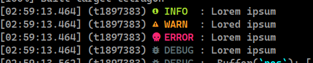

# Tetragon

This is the repository where I learn OpenGL using C++. In no way 
should this be considered a serious project with any purpose beside learning.

## Building

1. You can install all the needed packages using [vcpkg](https://vcpkg.io/):
```sh
vcpkg install
```

2. Then run CMake and compile the project using Makefile:
```sh
mkdir build
cd build
cmake .. && make
```

3. A single executable should be generated:
```sh
./tetragon
```

## Log icons
Tetragon utilizes emojis in its logs message format. To see them, you can install
and use [Nerd fonts](https://www.nerdfonts.com/) in your terminal.
Alternatively you can remove emojis by enabling `NO_LOG_EMOJIS` CMake option.

```sh
cd build
cmake -DNO_LOG_EMOJIS=ON .. && make
```

### Normal:


### `-DNO_EMOJIS=ON`

